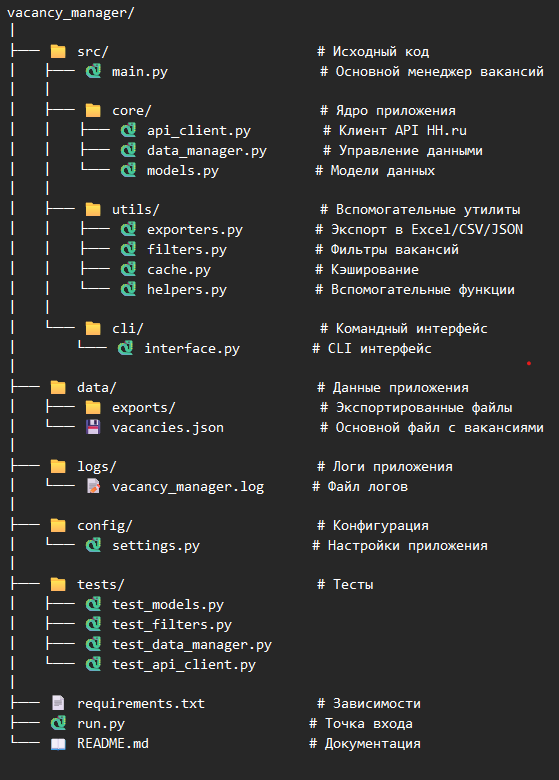

# 🚀 Менеджер вакансий HH.ru

Профессиональная система для поиска, управления и анализа вакансий с HeadHunter API. Поддерживает фильтрацию, экспорт в различные форматы и статистику.

## 📦 Возможности

- 🔍 **Поиск вакансий** с HeadHunter API
- 📝 **Ручное добавление** вакансий
- 🎛️ **Фильтрация** по компании, городу, зарплате, опыту
- 📊 **Экспорт** в Excel, CSV, JSON форматы
- 📈 **Статистика** и аналитика вакансий
- 💾 **Локальное хранение** данных
- ⚡ **Кэширование** для повышения производительности
- 🖥️ **Удобный CLI интерфейс**

## 🛠️ Установка

### Требования
- Python 3.8+
- pip (менеджер пакетов Python)

### Установка зависимостей
```bash
# Клонирование репозитория (если нужно)
git clone <your-repo-url>
cd vacancy_manager
```
```bash
# Установка зависимостей
pip install -r requirements.txt
```
### Создание необходимых директорий
```bash
mkdir -p data/exports logs
```
## 🚀 Запуск
### Основной способ
```bash
python run.py
```
### Или напрямую через менеджер
```bash
python -m src.cli.interface
```
### Запуск тестов
```bash
# Все тесты
python -m tests
```
```bash
# Конкретный тест
python -m tests.test_models
python -m tests.test_filters
```
## 📖 Использование
### Главное меню
```text
🎯 МЕНЕДЖЕР ВАКАНСИЙ HH.RU
============================================================
1. 🔍 Поиск и добавление вакансий с hh.ru
2. 📝 Добавить вакансию вручную
3. 👀 Показать все вакансии
4. 🎛️  Фильтровать вакансии
5. ❌ Удалить вакансию
6. 💾 Экспорт в Excel
7. 📄 Экспорт в CSV
8. 📋 Экспорт в JSON
9. 📊 Статистика
10. 🗑️ Очистить все вакансии
11. 🚪 Выход
============================================================
```
### Примеры использования
1. Поиск вакансий
```text
Выберите действие (1-11): 1
Введите поисковый запрос: Python developer
Количество вакансий: 50
```
2. Фильтрация
```text
Выберите действие (1-11): 4
Компания: Yandex
Город: Moscow
Минимальная зарплата: 100000
```
3. Экспорт данных
```text
Выберите действие (1-11): 6
Имя файла: my_vacancies.xlsx
```
## 📁 Структура проекта

## ⚙️ Конфигурация
Настройки приложения находятся в config/settings.py:

class Path:
pass

class Path:
pass

class Path:
pass

class Path:
pass

```python
# Пути и директории
BASE_DIR = Path(__file__).parent.parent
DATA_DIR = BASE_DIR / "data"
EXPORTS_DIR = DATA_DIR / "exports"
LOGS_DIR = BASE_DIR / "logs"

# Файлы
VACANCIES_FILE = DATA_DIR / "vacancies.json"
LOG_FILE = LOGS_DIR / "vacancy_manager.log"

# API настройки
HH_API_BASE_URL = "https://api.hh.ru/vacancies"
HH_API_TIMEOUT = 30
HH_API_AREA_RUSSIA = 113  # Код России в HH API
HH_API_USER_AGENT = "VacancyManager/1.0 (Tumashovster@Gmail.com)"

# Лимиты
MAX_VACANCIES_PER_REQUEST = 100
MAX_CACHE_SIZE = 1000
CACHE_TTL = 300  # 5 минут в секундах
```
## 🧪 Тестирование
### Проект включает comprehensive тесты:
```bash
# Запуск всех тестов
python -m tests
```
```bash
# С покрытием кода
pip install coverage
coverage run -m tests
coverage report
```
## 📊 Форматы экспорта
### Excel (.xlsx)
 - Структурированные данные с форматированием
 - Несколько листов для больших объемов данных
 - Автоматическое определение типов данных

### CSV (.csv)
 - UTF-8 кодировка с BOM
 - Разделитель точка с запятой
 - Подходит для импорта в Excel и другие системы

### JSON (.json)
 - Полная информация о вакансиях
 - Сохранение всех полей и структуры
 - Удобно для бэкапов и миграций
## 🔧 Разработка
### Установка для разработки
```bash
pip install -r requirements.txt
pip install -e .
```
### Code Style
#### Проект использует:
 - flake8 для проверки стиля кода
 - mypy для статической типизации
 - black для форматирования 
### Добавление новых функций
1. Создайте feature branch
2. Добавьте тесты для новой функциональности
3. Реализуйте функциональность
4. Проверьте code style
5. Создайте pull request

## 🤝 Contributing
1. Fork репозитория
2. Создайте feature branch (git checkout -b feature/amazing-feature)
3. Commit изменений (git commit -m 'Add amazing feature')
4. Push в branch (git push origin feature/amazing-feature)
5. Откройте Pull Request

## 📝 Лицензия
Этот проект распространяется под MIT License. Смотрите файл LICENSE для подробностей.

## 🐛 Поддержка и баги
Если вы нашли баг или у вас есть предложения по улучшению:

1. Проверьте существующие issues
2. Создайте новое issue с подробным описанием проблемы
3. Укажите версию Python и шаги для воспроизведения

## 📞 Контакты
Ваше имя - Anton Tumashov <Tumashovster@Gmail.com>

Ссылка на проект: https://github.com/Anton742-Tu/vacancy_manager
